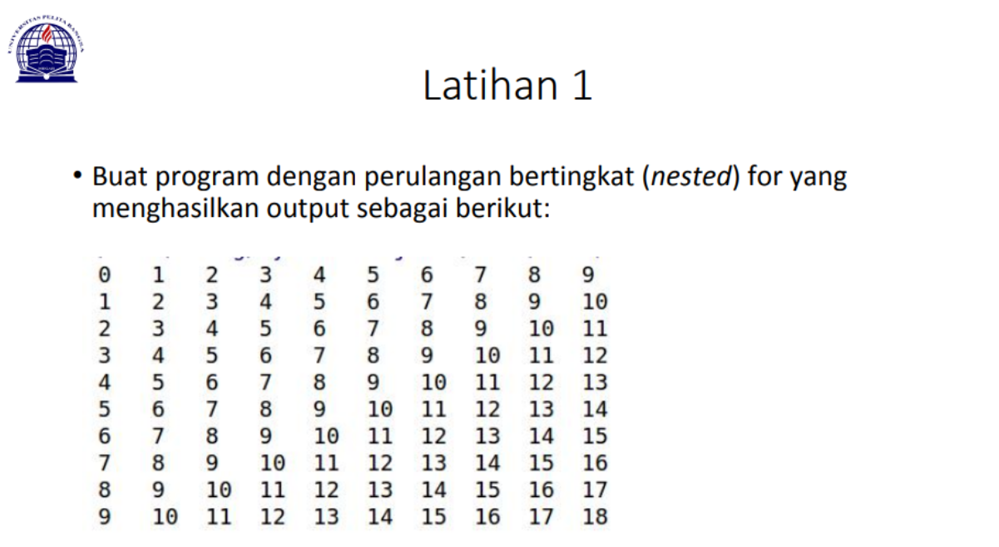

# Pertemuan7
# Muhammad Rifai Aditia
# Nim:312010065
___________________________________________________________
# DAFTAR TUGAS

<table border="2" cellpading="10">
  <tr>
    <td><b>Pertemuan7 </b></td>
    <td>Pertemuan7</td>
    <td><a href="https://github.com/adit567/Pertemuan7.git">Klik disini</td>
  </tr>
  <tr>
    <td><b>labspy2</b></td>
    <td>labspy2</td>
    <td><a href="https://github.com/adit567/labspy2.git">Klik disini</td>
  </tr>
  <tr>
    <td><b>labspy3</b></td>
    <td>labspy3</td>
    <td><a href="https://github.com/adit567/labspy3.git">Klik disini</td>
  </tr>
  <tr>
  
  </table>
   

Jadi pada pertemuan ini saya diberikan beberapa tugas oleh dosen saya yaitu diantaranya:

# PRAKTIKUM 1 - LATIHAN 1

Pada tugas pertama, saya diminta untuk membuat sebuah program pengulangan bertingkat yang nantinya akan menghasilkan output seperti gambat diatas. Untuk bisa dapat menghasilkan output tersebut maka saya memasukan syntax:

baris = 10
kolom = baris

for bar in range(baris):
    for col in range(kolom):
        tab = bar+col
        print("{0:>5}".format(tab), end='')
    print()
Mengapa demikian? Karena untuk dapat melakukan pengulangan bertingkat kamu perlu memasukan

for bar in range(baris):
    for col in range(kolom):
        tab = bar+col
        print("{0:>5}".format(tab), end='')
    print()
dan karena pada syntax tersebut kamu membutuhkan baris dan kolom maka sebelum memasukan syntax diatas kamu perlu menambahkan keterangan baris dan kolom sesuai yang kalian butuhkan seperti ini.

baris = 10
kolom = baris
Jika sudah memasukan semua syntax diatas dan telah di run, maka kamu akan mendapatkan tampilan seperti gambar yang ada dibawah ini

# PRAKTIKUM 1 - LATIHAN 2

Di tugas ke dua, saya diminta untuk mencari nilai acak yang bernominal dibawah 0,5. Maka saya memasukan syntax:

import random
print(40*"=")
print("Bilangan random yang lebih kecil dari 0,5")
print(40*"=")
jum = int( input("Masukan nilai n : "))
i = 0
for i in range(jum):
    i += 1
    angkaDec = random.uniform(0, 0.5)
    print("Data ke", i, " = ", angkaDec)
Syntax dibawah ini digunakan untuk mencari nilai random

import random
Sementara untuk menentukan jumlah input yang diinginkan maka perlu memasukan

jum = int( input("Masukan nilai n : "))
dan untuk menampilkan urutan data sesuai jumlah inputan dengan hasil di bawah 0.5 perlu memasukan

angkaDec = random.uniform(0, 0.5)
    print("Data ke", i, " = ", angkaDec)
Jika sudah memasukan semua syntax diatas dan telah di run, maka kamu akan mendapatkan tampilan seperti gambar yang ada dibawah ini

# Terimakasih